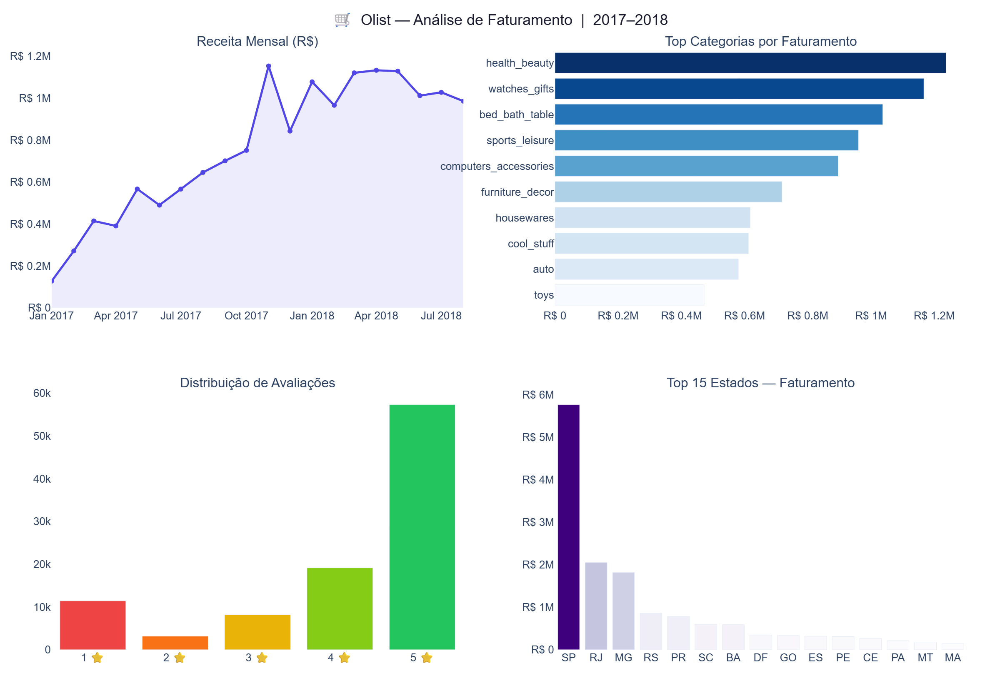
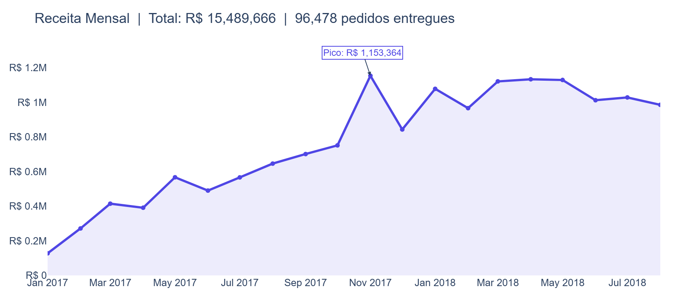
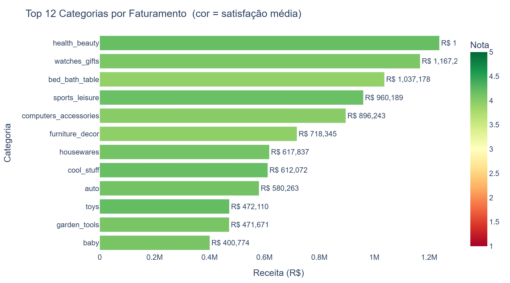

# 🛒 Análise de Faturamento — Olist E-Commerce Brasil

> Análise exploratória completa com SQL, Pandas e dashboard interativo Plotly Dash sobre o dataset público da Olist

---

## 📌 Sobre o Projeto

Projeto de **Análise de Dados** aplicado ao e-commerce brasileiro, utilizando o dataset público da **Olist** disponível no Kaggle (~100 mil pedidos reais de 2016 a 2018).

Os dados são carregados em um banco **SQLite** e analisados com **SQL puro** e **Pandas**, gerando visualizações interativas com **Plotly** e um **dashboard dinâmico** com filtros por estado.

### Perguntas de negócio respondidas

| # | Pergunta |
|---|----------|
| 1 | Qual a evolução da receita ao longo do tempo? |
| 2 | Quais categorias geram mais faturamento? |
| 3 | Quais estados concentram mais pedidos e receita? |
| 4 | Como está a satisfação dos clientes por categoria? |
| 5 | Qual o tempo médio de entrega vs. estimado por estado? |
| 6 | Quais são as formas de pagamento mais usadas? |

---

## 📊 Dashboard

Dashboard interativo com filtro por estado, KPI cards e gráficos em tempo real.



**Como rodar:**
```bash
pip install -r requirements.txt
python dashboard/app.py
# Acesse: http://localhost:8050
```

---

## 📈 Insights do Dataset

### Receita Mensal — R$ 15,4M em 96.478 pedidos entregues



> Crescimento consistente de 7× entre Jan/2017 e Nov/2017. **Pico de R$ 1,15M em novembro de 2017** (Black Friday). Estabilização em torno de R$ 1,1M/mês no primeiro semestre de 2018.

---

### Top Categorias por Faturamento



> **Health & Beauty** lidera com R$ 1,2M e nota média 4,1. **Watches & Gifts** em segundo com R$ 1,17M. Todas as 12 principais categorias mantêm satisfação acima de 3,9 — indicando boa consistência de qualidade.

---

## 🚀 Como Executar

### 1. Instalar dependências
```bash
pip install -r requirements.txt
```

### 2. Baixar o dataset
Acesse [Kaggle — Olist Brazilian E-Commerce](https://www.kaggle.com/datasets/olistbr/brazilian-ecommerce), baixe os CSVs e coloque-os na pasta `data/`.

### 3. Rodar o notebook de análise
```bash
jupyter notebook notebooks/01_analise_exploratoria.ipynb
```

### 4. Rodar o dashboard
```bash
python dashboard/app.py
```

---

## 📁 Estrutura do Projeto

```
AnaliseFaturamento/
│
├── data/                          # CSVs do Olist (não versionados) + banco SQLite
│   └── .gitkeep
│
├── notebooks/
│   └── 01_analise_exploratoria.ipynb   # EDA completa com SQL + Plotly
│
├── sql/
│   └── queries.sql                # Todas as queries SQL organizadas
│
├── dashboard/
│   └── app.py                     # Dashboard interativo Plotly Dash
│
├── images/                        # Prints e assets visuais
├── requirements.txt
└── README.md
```

---

## 🔍 Análises Realizadas

### 📈 Receita Mensal
Evolução do faturamento com identificação de sazonalidade e pico de Black Friday.

### 🏷️ Top Categorias
Faturamento, ticket médio e nota de satisfação por categoria de produto.

### 🗺️ Distribuição Geográfica
Volume de pedidos e receita por estado, revelando concentração no Sudeste.

### ⭐ Satisfação dos Clientes
Distribuição de avaliações com cruzamento por categoria e tempo de entrega.

### ⏱️ Análise de Entrega
Tempo real vs. estimado por estado — identificação de gargalos logísticos.

### 💳 Formas de Pagamento
Participação por método de pagamento e média de parcelas no cartão de crédito.

---

## 🛠️ Tecnologias


---

## 📚 Conceitos Aplicados

| Conceito | Descrição |
|----------|-----------|
| **SQL com SQLite** | Window functions, JOINs múltiplos, agregações |
| **EDA** | Análise exploratória com storytelling orientado ao negócio |
| **Visualização** | Gráficos interativos com Plotly Express e Graph Objects |
| **Dashboard** | App reativo com Plotly Dash e filtros dinâmicos |
| **ETL simplificado** | Leitura de CSVs e persistência em banco relacional |

---

## 🔮 Próximas Etapas

- [ ] Segmentação de clientes com RFM + K-Means
- [ ] Previsão de demanda com Prophet
- [ ] Deploy do dashboard no Render ou Railway
- [ ] Análise de cohort de retenção de clientes

---

## 📖 Fonte dos Dados

> **Olist Brazilian E-Commerce Public Dataset**  
> [kaggle.com/datasets/olistbr/brazilian-ecommerce](https://www.kaggle.com/datasets/olistbr/brazilian-ecommerce)  
> Licença: CC BY-NC-SA 4.0

---

## 👨‍💻 Autor

**Augusto Matos** — Analista de Dados & Desenvolvedor Python

[](https://www.linkedin.com/in/augusto-matos-b92887204)
[](mailto:augusto.ivan83@outlook.com)
[](https://github.com/augmatos)
